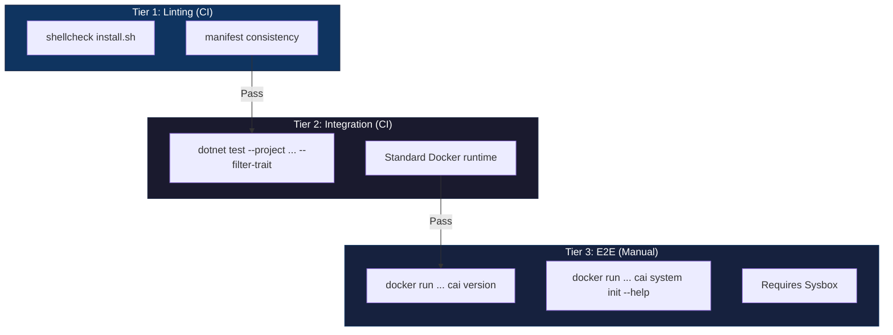

# Testing Guide

This document describes how to run ContainAI tests locally and in CI.

## Test Tiers

ContainAI uses a tiered testing strategy:



### Tier 1: Linting (CI - ubuntu-24.04)

Host-side checks that don't require Docker:

```bash
# Shell script linting
shellcheck -x install.sh

# Manifest consistency check
dotnet run --project src/cai -- manifest check src/manifests
```

### Tier 2: Integration Tests (CI - ubuntu-24.04 / ubuntu-24.04-arm)

Tests that run against standard Docker runtime:

```bash
# Run all integration tests
dotnet test --project tests/ContainAI.Cli.Tests/ContainAI.Cli.Tests.csproj --configuration Release -- --filter-trait "Category=SyncIntegration" --xunit-info

# Use a pre-built image (CI does this)
IMAGE_NAME="containai:latest" dotnet test --project tests/ContainAI.Cli.Tests/ContainAI.Cli.Tests.csproj --configuration Release -- --filter-trait "Category=SyncIntegration" --xunit-info
```

These tests cover:
- CLI help and basic functionality
- Import dry-run and full sync
- Secret permissions
- Plugin loading
- Symlink handling
- Environment variable import
- Hot-reload and data persistence scenarios

### Tier 3: E2E Smoke Tests (Manual - requires sysbox)

Full system container tests require sysbox runtime for systemd support. These are not run automatically in CI due to infrastructure requirements.

**Prerequisites:**
- Linux host with sysbox installed
- Docker configured with sysbox-runc runtime

**Running E2E smoke checks:**

```bash
# Verify sysbox is available
docker info --format '{{json .Runtimes}}' | grep -q sysbox-runc

# Run smoke checks against the base image (requires sysbox)
docker --context containai-docker pull ghcr.io/novotnyllc/containai/base:latest
docker --context containai-docker run --rm --runtime=sysbox-runc ghcr.io/novotnyllc/containai/base:latest cai version
docker --context containai-docker run --rm --runtime=sysbox-runc ghcr.io/novotnyllc/containai/base:latest cai system init --help
```

**Why sysbox is required:**

ContainAI system containers run systemd as PID 1 and support Docker-in-Docker. This requires:
- User namespace isolation
- Nested container support
- procfs/sysfs virtualization

These features are provided by sysbox runtime, not standard runc.

## CI Workflow

The GitHub Actions workflow (`docker.yml`) runs:

1. **lint job**: shellcheck + manifest consistency (always)
2. **build job**: Build Docker images (after lint)
3. **test job**: Integration tests, ACP .NET tests, and runtime smoke checks against built images

E2E tests are documented for manual execution on self-hosted infrastructure.

## Coverage Gate Policy

`docker.yml` test jobs run .NET unit tests with coverage in Cobertura format and generate merged reports. The build fails when coverage artifacts are missing.

A hard threshold gate is enforced in CI:
- `ContainAI.Cli` line coverage must be **>= 97%**
- `ContainAI.Cli.Abstractions` line coverage must be **>= 97%**
- `AgentClientProtocol.Proxy` line coverage must be **>= 97%**

These thresholds are validated from the generated `Summary.txt` coverage report in CI.
Test execution uses `xunit.v3.mtp-v2` on Microsoft Testing Platform v2.

Example local proxy coverage check (MTP v2 style):

```bash
dotnet test --project tests/AgentClientProtocol.Proxy.Tests/AgentClientProtocol.Proxy.Tests.csproj -c Release -- --coverage --coverage-output-format cobertura --coverage-output artifacts/TestResults/proxy-only.cobertura.xml
reportgenerator "-reports:artifacts/bin/AgentClientProtocol.Proxy.Tests/release/TestResults/artifacts/TestResults/proxy-only.cobertura.xml" "-targetdir:artifacts/TestResults/ProxyOnlyCoverage" "-reporttypes:TextSummary"
```

## Test Resource Cleanup

Integration tests use labeled Docker resources for safe cleanup:

- Volumes: `containai.test=1` label, `test-` prefix
- Containers: `containai.test=1` label, `test-` prefix

Resources are automatically cleaned up at test completion. For manual cleanup:

```bash
# Clean up by label (safe)
docker stop $(docker ps -q --filter "label=containai.test=1") 2>/dev/null || true
docker rm $(docker ps -aq --filter "label=containai.test=1") 2>/dev/null || true
docker volume rm $(docker volume ls -q --filter "label=containai.test=1") 2>/dev/null || true
```

## Adding New Tests

When adding tests to the sync integration suite:

1. Add tests to `tests/ContainAI.Cli.Tests/SyncIntegrationTests.cs`
2. Mark each new test with `[Trait("Category", "SyncIntegration")]`
3. Use Docker volume names with random GUID suffixes for isolation
4. Ensure every created volume/container is cleaned up in `finally` blocks
