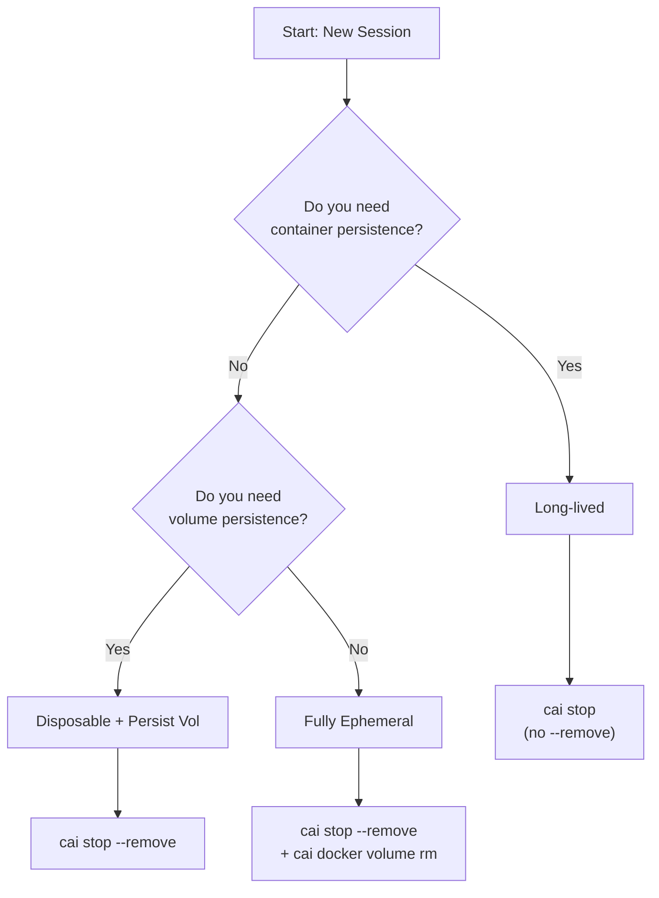

# Usage Patterns

This guide documents the three primary usage modes for ContainAI containers. Choose the pattern that best fits your workflow.

## Overview

ContainAI separates container lifecycle from data persistence, giving you control over what gets preserved between sessions:

- **Container**: The running environment (can be stopped or removed)
- **Data volume**: Credentials, plugins, configuration (persists independently)

This separation enables three distinct usage patterns.

## Pattern 1: Disposable Container, Persistent Preferences (Default)

The recommended workflow for most users. ContainAI keeps containers unless you explicitly remove them (see [Container Lifecycle](lifecycle.md)), but removing containers after each session (`cai stop --remove`) is preferred because credentials and configuration persist in the data volume regardless.

### When to Use

- Regular development work
- You want fast, clean container starts
- You need agent credentials to persist
- You don't need in-container state between sessions

### Workflow

```bash
# Start a session
cai

# Work in the container...

# End session: remove container, keep volume
cai stop --remove
```

### What Gets Preserved

| Resource | Preserved | Notes |
|----------|-----------|-------|
| Container | No | Removed on `cai stop --remove` |
| Data volume | Yes | Credentials, plugins, settings |
| Agent auth | Yes | OAuth tokens, API keys |
| Shell history | Yes | Stored in data volume |
| Workspace files | Yes | Mounted from host |

### Typical Session

```bash
# Day 1: First use
cai                    # Creates container + volume
# ... work ...
cai stop --remove      # Removes container, keeps volume

# Day 2: Return
cai                    # New container, existing volume
# ... credentials still work, history intact ...
```

### Flags

- `cai --fresh`: Force container recreation (same as `cai stop --remove && cai`)
- `cai --restart`: Alias for `--fresh`

## Pattern 2: Fully Ephemeral (True Isolation)

For scenarios requiring complete isolation with no persistent state. Both container and volume are removed after each session.

### When to Use

- Untrusted code analysis
- CI/CD pipelines
- Security-sensitive work
- Reproducible environments
- Testing with clean state

### Workflow

```bash
# Start a session
cai

# Work in the container...

# End session: remove container
cai stop --remove

# Delete the volume (manual step - no --remove-volume flag exists)
cai docker volume rm "$(cai config get data_volume | cut -f1)"
```

> **Note**: There is no `--remove-volume` flag. Volume deletion must be done manually with `cai docker volume rm`.

### What Gets Preserved

| Resource | Preserved | Notes |
|----------|-----------|-------|
| Container | No | Removed |
| Data volume | No | Manually deleted |
| Agent auth | No | Must re-authenticate each session |
| Shell history | No | Lost with volume |
| Workspace files | Yes | Still on host |

### Volume Deletion

The `cai config get` command outputs `value<TAB>source` format. Use `cut -f1` to extract just the volume name:

```bash
# See what volume would be deleted
cai config get data_volume
# Example output: myproject-abc123    repo-local

# Delete the volume (uses containai-docker context)
cai docker volume rm "$(cai config get data_volume | cut -f1)"

# Alternative: note the volume name and delete manually
cai docker volume rm myproject-abc123
```

## Pattern 3: Long-lived Persistent Environment

Preserve both the container and volume across sessions. The container is stopped (not running) between sessions but remains intact, allowing faster restarts. Ideal for heavily customized environments or long-running projects.

### When to Use

- Ongoing projects spanning multiple days
- Heavily customized container environments
- Projects with complex setup that shouldn't be repeated
- You want faster restarts with preserved container state

### Workflow

```bash
# Start a session
cai

# Work in the container...

# End session: stop but keep everything
cai stop

# Later: resume where you left off
cai
```

### What Gets Preserved

| Resource | Preserved | Notes |
|----------|-----------|-------|
| Container | Yes | Stopped but not removed |
| Data volume | Yes | Credentials, plugins, settings |
| In-container state | Yes | Installed packages, filesystem changes (processes stop) |
| Agent auth | Yes | OAuth tokens, API keys |
| Shell history | Yes | Stored in data volume |
| Workspace files | Yes | Mounted from host |

### Benefits

- **Faster restarts**: No container creation overhead
- **Preserved state**: In-container installations and filesystem changes persist
- **Resume work**: Pick up where you left off (though processes must be restarted)

### Considerations

- Uses more disk space (container layer preserved)
- Container state may become stale after image updates
- May need periodic cleanup with `cai --fresh`

## Comparison Table

| Aspect | Disposable + Persist Vol | Fully Ephemeral | Long-lived |
|--------|--------------------------|-----------------|------------|
| **Stop command** | `cai stop --remove` | `cai stop --remove` + volume rm | `cai stop` |
| **Container** | Recreated each session | Recreated + deleted | Preserved |
| **Volume** | Preserved | Deleted | Preserved |
| **Agent credentials** | Persist | Must re-auth | Persist |
| **In-container state** | Lost | Lost | Preserved |
| **Startup speed** | Medium | Slow (setup) | Fast |
| **Isolation** | Medium | Maximum | Minimum |
| **Disk usage** | Low | Minimal | Higher |
| **Use case** | Development | CI/untrusted code | Long projects |

## Choosing a Pattern



**Decision questions:**

1. **Do you need container persistence?** (installed packages, filesystem changes)
   - Yes → **Long-lived**
   - No → Continue to question 2

2. **Do you need volume persistence?** (credentials, configuration)
   - Yes → **Disposable + Persist Vol** (default, recommended)
   - No → **Fully Ephemeral**

## Migration Scenarios

### From Disposable to Long-lived

**Situation**: You've been using `cai stop --remove` but want to keep the container preserved between sessions.

**Solution**: Just use `cai stop` instead:

```bash
# Instead of:
cai stop --remove

# Use:
cai stop
```

The container remains stopped but intact. Next `cai` resumes it.

### I Want to Truly Start Fresh

**Situation**: You want everything deleted (container + volume) before starting over.

**Solution**:

```bash
cai stop --remove && cai docker volume rm "$(cai config get data_volume | cut -f1)"
```

### Keep Credentials, Recreate Container

**Situation**: Container issues but want to keep credentials intact.

**Solution**: Use `--fresh`:

```bash
cai --fresh
# Or equivalently:
cai stop --remove && cai
```

Container is recreated; volume (with credentials) is preserved.

## Data Flow Summary

Understanding what syncs helps choose the right pattern:

```
┌─────────────────┐      ┌─────────────────┐      ┌─────────────────┐
│   Host System   │      │   Data Volume   │      │    Container    │
├─────────────────┤      ├─────────────────┤      ├─────────────────┤
│ ~/.claude/      │─sync→│ /claude/        │─link→│ ~/.claude/      │
│ ~/.config/gh/   │─sync→│ /config/gh/     │─link→│ ~/.config/gh/   │
│ ~/.gemini/      │─sync→│ /gemini/        │─link→│ ~/.gemini/      │
│ ~/.codex/       │─sync→│ /codex/         │─link→│ ~/.codex/       │
└─────────────────┘      └─────────────────┘      └─────────────────┘
     (host home)          (Docker volume)          (container home)
```

- **sync**: Host configs copied to volume on `cai import`
- **link**: Container paths symlinked to volume locations

See [Sync Architecture](sync-architecture.md) for full details on what syncs.

## Best Practices

### For Disposable Pattern (Default)

- Run `cai import` periodically to sync host config changes
- Use `cai export` before major changes to back up volume

### For Ephemeral Pattern

- Script the cleanup for consistency
- Consider CI-specific configuration in `.containai/config.toml`
- Be prepared to re-authenticate agents each session

### For Long-lived Pattern

- Periodically run `cai --fresh` to pick up image updates
- Monitor disk usage (`docker system df`)
- Consider `cai export` for backups

## Related Documentation

- [Container Lifecycle](lifecycle.md): Detailed lifecycle management, including [stop behaviors](lifecycle.md#stop-vs-remove) and [volume persistence rules](lifecycle.md#volume-persistence-rules)
- [Sync Architecture](sync-architecture.md): What syncs between host and container
- [Configuration Reference](configuration.md): Config options and workspace settings
- [Quickstart Guide](quickstart.md): Getting started with ContainAI
