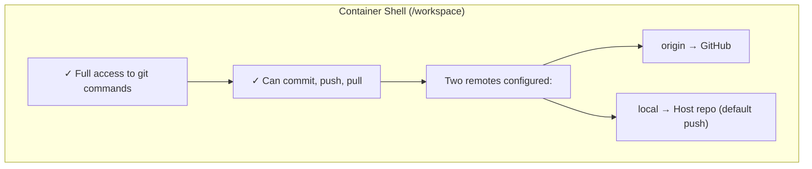
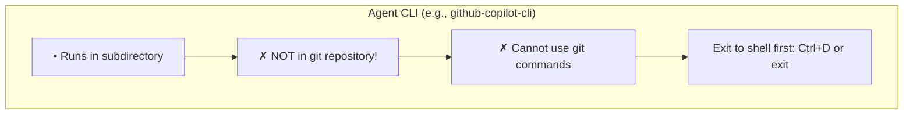
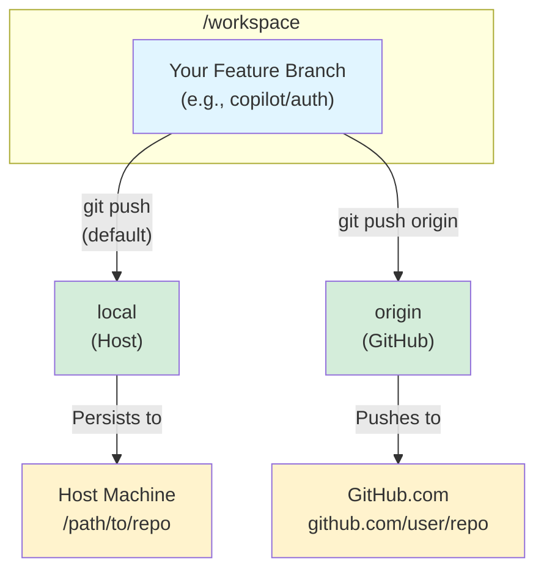

# Working Inside Containers

Understand how to connect to running containers, navigate the workspace, and see what the launchers configure for you.

## Connect from VS Code

Containers run in the background. Connect anytime:

1. Install **Dev Containers** extension
2. Click the remote button (bottom-left)
3. Select "Attach to Running Container"
4. Choose your container (e.g., `copilot-app`)

Or via command line:
```bash
docker exec -it copilot-app bash
```

## Inside the Container

### Repository Location

Your code is at `/workspace`:
```bash
cd /workspace
ls -la
```

### Git Workflow: Understanding the Container Environment

The container has **two separate contexts** for working with git:

#### Context 1: Interactive Shell (bash)


#### Context 2: Agent CLI Mode


**Common Error:** Running git commands while in agent CLI:
```bash
copilot> git status
fatal: not a git repository
```

**Solution:** Exit agent CLI first (Ctrl+D), then run git commands:
```bash
copilot> ^D  # Exit agent
$ git status  # Now works!
```

#### Dual Remote Configuration

The container is configured with two git remotes for maximum flexibility:



**Default push target:** `local` (host machine)  
**Why?** Preserves changes on host even if container is deleted.

#### Git Remote Commands

**Check configured remotes:**
```bash
git remote -v
# origin  https://github.com/user/repo.git (fetch)
# origin  https://github.com/user/repo.git (push)
# local   /path/to/host/repo (fetch)
# local   /path/to/host/repo (push)
```

**Push to host (default - RECOMMENDED):**
```bash
git push
# Pushes to local remote (host machine)
# Changes are immediately visible on host
```

**Push to GitHub (for pull requests):**
```bash
git push origin
# Pushes to GitHub
# Use for creating PRs or backing up to remote
```

**Pull from host:**
```bash
git pull local main
# Syncs with host's main branch
```

**Pull from GitHub:**
```bash
git pull origin main
# Syncs with GitHub's main branch
```

#### Common Workflows

**Workflow 1: Quick local development (no PR)**
```bash
# Work in VS Code or shell
# ...make changes...

# Commit and push to host
git add .
git commit -m "Implemented feature"
git push  # Goes to host by default
```

**Workflow 2: Create GitHub PR**
```bash
# Work in VS Code or shell
# ...make changes...

# Commit and push to both remotes
git add .
git commit -m "Implemented feature"
git push         # Save to host first
git push origin  # Then push to GitHub for PR
```

**Workflow 3: Sync with team changes**
```bash
# Pull latest from GitHub
git pull origin main

# Merge into your feature branch
git merge origin/main

# Push updates to host
git push
```

#### Troubleshooting Git Issues

**Problem:** `fatal: not a git repository`
- **Cause:** You're in agent CLI mode, not the shell
- **Solution:** Exit agent (Ctrl+D), then run git commands

**Problem:** `git push` doesn't update GitHub
- **Cause:** Default push goes to `local` remote (host)
- **Solution:** Use `git push origin` for GitHub

**Problem:** Lost changes after deleting container
- **Cause:** Forgot to push before `docker rm`
- **Solution:** Always `git push` (to host) or `git push origin` (to GitHub) before removing containers

**Problem:** Can't push to host from container
- **Cause:** Host repo may not have your feature branch
- **Solution:** Push creates the branch automatically, or use `git push origin` instead

## MCP Configuration

If your workspace has `config.toml`, the launcher renders it on the host (before the container starts) and drops per-agent JSON plus stub manifests into the session tmpfs.

**Example config.toml:**
```toml
[mcp_servers.github]
command = "npx"
args = ["-y", "@modelcontextprotocol/server-github"]

[mcp_servers.context7]
command = "npx"
args = ["-y", "@upstash/context7-mcp"]
env = { CONTEXT7_API_KEY = "${CONTEXT7_API_KEY}" }
```

Secrets like `CONTEXT7_API_KEY` resolve from `~/.config/coding-agents/mcp-secrets.env` during host-side rendering; the plaintext values never need to exist inside the container.

## What Happens Behind the Scenes

When you run `launch-agent`:

1. **Detects source:**
   - Local path: Copies entire repo into container
   - GitHub URL: Clones repo into container

2. **Renders session + issues capabilities (host):**
   - `render-session-config.py` merges `config.toml`, CLI flags, and your secrets file.
   - Launcher stores required secrets inside the broker and requests sealed capabilities for each MCP stub.
   - Manifest + capability IDs are hashed and logged for auditing.

3. **Creates container:**
   - Mounts OAuth configs from host (read-only) and spins up `/run/coding-agents` tmpfs.
   - Copies the rendered manifest, agent-specific MCP JSON, and sealed capabilities into the tmpfs before any user code runs.
   - Exposes provenance data via `HOST_SESSION_*` environment variables.

4. **Sets up git:**
   - Sets `origin` remote (GitHub)
   - Sets `local` remote (host path, if applicable)
   - Sets `local` as default push target
   - Configures credential/GPG proxies for the host

5. **Creates branch:**
   - Checks out `<agent>/<branch-name>`
   - Example: `copilot/feature-auth`

6. **Bootstraps MCP stubs:**
   - `entrypoint.sh` enforces ptrace/AppArmor policies and installs the manifest into `~/.config/<agent>/mcp`.
   - `mcp-stub` becomes the only launcher for MCP servers; it redeems capabilities and injects decrypted secrets into stub-owned tmpfs.

7. **Ready:**
   - Container runs in background
   - Connect via VS Code or shell

## Security Notes

✅ **Secure by default:**
- Launchers hash trusted files and log the manifest SHA256 before any secrets are issued.
- Secrets stay on the host broker until `mcp-stub` redeems a capability into a stub-owned tmpfs.
- Containers run as non-root with seccomp/AppArmor, read-only rootfs, and dedicated tmpfs mounts for `/run/coding-agents`.
- OAuth configs and credential/GPG proxies are mounted read-only.

⚠️ **Keep secure:**
- `~/.config/coding-agents/mcp-secrets.env` (host-only, outside any git repo)
- Don't commit `.env` files with real tokens
- Avoid modifying `scripts/launchers` or `scripts/runtime` without understanding how it affects manifest hashes
