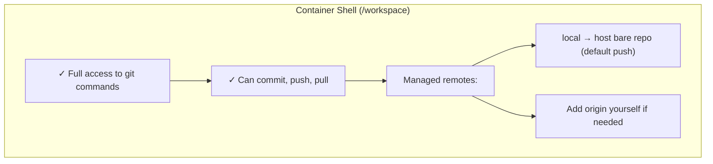
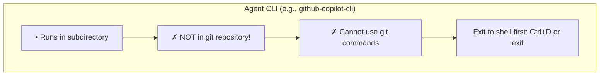
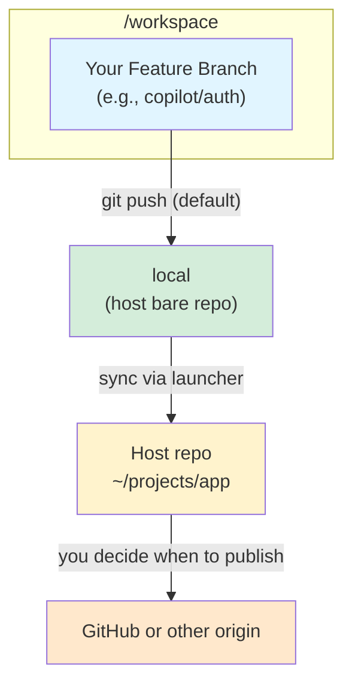

# Working Inside Containers

Understand how to connect to running containers, navigate the workspace, and see what the launchers configure for you.

## Connect from VS Code

Containers run in the background. Connect anytime:

1. Install **Dev Containers** extension
2. Click the remote button (bottom-left)
3. Select "Attach to Running Container"
4. Choose your container (e.g., `copilot-app`)

Or via command line:
```bash
docker exec -it copilot-app bash
```

## Inside the Container

### Repository Location

Your code is at `/workspace`:
```bash
cd /workspace
ls -la
```

### Git Workflow: Understanding the Container Environment

The container has **two separate contexts** for working with git:

#### Context 1: Interactive Shell (bash)


#### Context 2: Agent CLI Mode


**Common Error:** Running git commands while in agent CLI:
```bash
copilot> git status
fatal: not a git repository
```

**Solution:** Exit agent CLI first (Ctrl+D), then run git commands:
```bash
copilot> ^D  # Exit agent
$ git status  # Now works!
```

#### Managed Local Remote (no upstream origin)

Containers intentionally strip every upstream remote. Only the managed `local` remote remains, pointing at the host-side bare repository the launchers created for you.



**Default push target:** `local`  
**Why?** Preserves work in a host-owned bare repo even if the container disappears, while keeping the container isolated from GitHub. Publishing to GitHub (or any other upstream) happens from your host git client after you review the agent's commits.

Need to talk to GitHub from inside the container anyway? Add a remote yourself (`git remote add origin https://...`) so you consciously accept that trust boundary. The launchers will never configure it for you.

Every time you `git push` to `local`, a background sync daemon fast-forwards the matching branch in your host repository. Unless you opt out with `CONTAINAI_DISABLE_AUTO_SYNC=1`, you can simply switch back to your host repo after a push and the commit will already be there.

#### Git Remote Commands

**Check configured remotes:**
```bash
git remote -v
# local  /tmp/local-remote (fetch)
# local  /tmp/local-remote (push)
```

If you launched with `--no-push`, there will be no remotes. Copy files out manually or add the remotes you need.

**Push to host (default - recommended):**
```bash
git push
# Writes to the managed local remote mounted at /tmp/local-remote
```

**Pull from host bare repo:**
```bash
git pull local main
```

**Publish to GitHub:**
1. Inside the container: commit + `git push` (updates the managed bare repo and auto-syncs your host working tree).
2. On the host: switch to your repo (already updated) and run `git push origin` when you're satisfied.

#### Common Workflows

**Workflow 1: Quick local development (no PR yet)**
```bash
# Work in VS Code or shell
git add .
git commit -m "Implemented feature"
git push              # Saves to local bare repo + auto-syncs host repo

# Back on host workstation (already updated)
cd ~/projects/app
git status
```

**Workflow 2: Publish to GitHub**
```bash
# Inside container
git add .
git commit -m "Implemented feature"
git push                   # Updates bare repo + host workspace

# Back on host workstation (branch already fast-forwarded)
cd ~/projects/app
git switch copilot/feature-auth
git push origin copilot/feature-auth
```

**Workflow 3: Sync with team changes**
```bash
# On host: bring latest changes into your repo
cd ~/projects/app
git pull origin main

# Relaunch the agent (or recopy the repo) so the container picks up the new snapshot
```

#### Troubleshooting Git Issues

**Problem:** `fatal: not a git repository`
- **Cause:** You're in agent CLI mode, not the shell
- **Solution:** Exit agent (Ctrl+D), then run git commands

**Problem:** `git push` doesn't update GitHub
- **Cause:** Containers still only push to the managed `local` remote.
- **Solution:** After the auto-sync completes, switch to your host repo and run `git push origin`. If you disabled auto-sync (`CONTAINAI_DISABLE_AUTO_SYNC=1`), manually fetch from `~/.containai/local-remotes/<hash>.git` first.

**Problem:** Lost changes after deleting container
- **Cause:** Forgot to `git push` before `docker rm`
- **Solution:** Always push to the local remote (default). When you remove the container with the launcher, the host automatically merges from the bare repo.

**Problem:** Need latest commits from GitHub inside container
- **Cause:** Containers are isolated from upstream remotes.
- **Solution:** Update on the host (e.g., `git pull origin main`), then relaunch the container so it copies the refreshed working tree.

**Problem:** Need to talk to GitHub from inside the container
- **Cause:** Remote was intentionally removed.
- **Solution:** Manually run `git remote add origin https://github.com/user/repo.git` inside the container once you are ready to allow that access.

## MCP Configuration

If your workspace has `config.toml`, the launcher renders it on the host (before the container starts) and drops per-agent JSON plus stub manifests into the session tmpfs.

**Example config.toml:**
```toml
[mcp_servers.github]
command = "npx"
args = ["-y", "@modelcontextprotocol/server-github"]

[mcp_servers.context7]
command = "npx"
args = ["-y", "@upstash/context7-mcp"]
env = { CONTEXT7_API_KEY = "${CONTEXT7_API_KEY}" }
```

Secrets like `CONTEXT7_API_KEY` resolve from `~/.config/containai/mcp-secrets.env` during host-side rendering; the plaintext values never need to exist inside the container.

## What Happens Behind the Scenes

When you run `launch-agent`:

1. **Detects source:**
   - Local path: Copies entire repo into container
   - GitHub URL: Clones repo into container

2. **Renders session + issues capabilities (host):**
   - `render-session-config.py` merges `config.toml`, CLI flags, and your secrets file.
   - Launcher stores required secrets inside the broker and requests sealed capabilities for each MCP stub.
   - Manifest + capability IDs are hashed and logged for auditing.

3. **Creates container:**
   - Mounts OAuth configs from host (read-only) and spins up `/run/containai` tmpfs.
   - Copies the rendered manifest, agent-specific MCP JSON, and sealed capabilities into the tmpfs before any user code runs.
   - Exposes provenance data via `HOST_SESSION_*` environment variables.

4. **Sets up git:**
   - Removes upstream remotes so the container cannot reach your GitHub origin by default
   - Configures the managed `local` remote (host bare repo) when available
   - Sets `local` as the default push target
   - Configures credential/GPG proxies for host-mediated operations

5. **Creates branch:**
   - Checks out `<agent>/<branch-name>`
   - Example: `copilot/feature-auth`

6. **Bootstraps MCP stubs:**
   - `entrypoint.sh` enforces ptrace/AppArmor policies and installs the manifest into `~/.config/<agent>/mcp`.
   - `mcp-stub` becomes the only launcher for MCP servers; it redeems capabilities and injects decrypted secrets into stub-owned tmpfs.

7. **Ready:**
   - Container runs in background
   - Connect via VS Code or shell

## Security Notes

✅ **Secure by default:**
- Launchers hash trusted files and log the manifest SHA256 before any secrets are issued.
- Secrets stay on the host broker until `mcp-stub` redeems a capability into a stub-owned tmpfs.
- Containers run as non-root with seccomp/AppArmor, read-only rootfs, and dedicated tmpfs mounts for `/run/containai`.
- OAuth configs and credential/GPG proxies are mounted read-only.

⚠️ **Keep secure:**
- `~/.config/containai/mcp-secrets.env` (host-only, outside any git repo)
- Don't commit `.env` files with real tokens
- Avoid modifying `host/launchers` or `docker/runtime` without understanding how it affects manifest hashes
