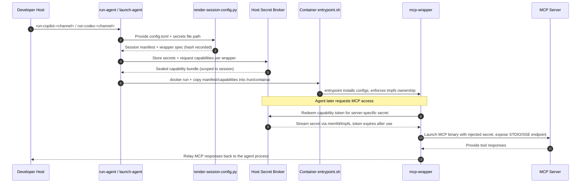

# MCP (Model Context Protocol) Setup Guide

Model Context Protocol (MCP) servers extend the capabilities of AI agents by providing access to external tools, APIs, and data sources. This guide explains how to configure MCP servers for use with ContainAI.

## Table of Contents

- [What is MCP?](#what-is-mcp)
- [Available MCP Servers](#available-mcp-servers)
- [Configuration](#configuration)
- [Setting Up Secrets](#setting-up-secrets)
- [Using MCP Config Files](#using-mcp-config-files)
- [Per-Agent Configuration](#per-agent-configuration)
- [Testing Your Setup](#testing-your-setup)
- [Troubleshooting](#troubleshooting)

## What is MCP?

Model Context Protocol is a standard for connecting AI agents to external tools and data sources. MCP servers act as bridges between your agent and services like:

- **GitHub**: Repositories, issues, pull requests, workflows
- **Documentation**: Microsoft Learn, library docs, API references  
- **Browser Automation**: Playwright for web testing and scraping
- **Code Analysis**: Serena for semantic code understanding
- **Time/Date**: Time zone conversions and scheduling
- **File Systems**: Reading and writing files
- **Databases**: Query execution and schema inspection

## Available MCP Servers

ContainAI includes the following MCP servers in all images:

| Server | Purpose | Authentication Required |
|--------|---------|------------------------|
| **github** | GitHub API access (repos, issues, PRs) | ✅ GITHUB_TOKEN |
| **microsoft-docs** | Microsoft Learn documentation | ❌ None |
| **playwright** | Browser automation and testing | ❌ None |
| **context7** | Library documentation search | ✅ CONTEXT7_API_KEY |
| **serena** | Code analysis and understanding | ❌ None |
| **time** | Time zone and date operations | ❌ None |
| **fetch** | Web page fetching and parsing | ❌ None |

### Additional MCP Servers (Optional)

You can add more MCP servers by modifying your config.

**Reference Servers (Official):**
- **filesystem**: Local file operations
- **git**: Git repository operations

**Third-Party & Community Servers:**
Hundreds of servers are available for databases, cloud services, APIs, and development tools. Visit the [MCP Server Registry](https://github.com/modelcontextprotocol/servers) for the complete, up-to-date list.

**Examples include:**
- Database integrations (PostgreSQL, MySQL, SQLite, MongoDB)
- Web search (Brave, Google)
- Cloud platforms (AWS, Azure, GCP)
- Developer tools (Sentry, Linear, Jira)

**Note:** Always check the registry for current status. Some servers are archived or deprecated.

## Configuration

MCP configuration is managed through two mechanisms:

1. **Secrets file**: `~/.config/containai/mcp-secrets.env` - API keys and tokens
2. **Config file**: `~/.config/containai/config.toml` - Server configurations

### Host-side rendering

ContainAI resolves `config.toml` **before** a container starts. The launcher invokes `render-session-config.py`, which:

- Reads your repo-level `config.toml` plus any `~/.config/containai/config[-<agent>].toml` overrides.
- Loads secrets from `~/.config/containai/mcp-secrets.env` (or `MCP_SECRETS_FILE`) while on the host.
- Substitutes `$VAR` / `${VAR}` placeholders everywhere they appear (arguments, env blocks, `bearer_token_env_var`, etc.).
- Emits fully resolved JSON configs for each agent (`~/.config/<agent>/mcp/config.json` inside the container) and a stub manifest that maps servers → `mcp-wrapper` command lines.

Because the resolved JSON lives only in the session tmpfs, containers operate without direct access to your plaintext secrets file.

### End-to-end Secret & Wrapper Flow

The diagram below shows the full lifecycle for secrets from the host to the MCP wrapper inside the container:



Key points:

- All MCP servers go through a proxy mechanism (helper proxy for remote, wrapper for local)
- Secrets are supplied either by the host-broker rendered configs or by converting `/workspace/config.toml` at container start
- Pre-existing MCP configs are automatically rewritten to go through the proxy
- The generated JSON lives on the container's writable layer and disappears when the container exits
- MCP wrappers run under dedicated UIDs, fetch secrets at launch via the broker, and keep them inside private tmpfs mounts

For detailed architecture information, see [MCP Proxy Architecture](../development/mcp-proxy-architecture.md).

## Setting Up Secrets

### 1. Create the secrets file

```bash
# Copy the example
cp mcp-secrets.env.example ~/.config/containai/mcp-secrets.env

# Or create directory if needed
mkdir -p ~/.config/containai
```

**Windows:**
```powershell
mkdir $env:USERPROFILE\.config\containai -Force
copy mcp-secrets.env.example $env:USERPROFILE\.config\containai\mcp-secrets.env
```

### 2. Add your API keys

Edit `~/.config/containai/mcp-secrets.env`:

```bash
# GitHub Personal Access Token
GITHUB_TOKEN=ghp_your_token_here

# Context7 API Key (for library documentation)
CONTEXT7_API_KEY=your_context7_key_here

# Optional: Other service tokens
# ANTHROPIC_API_KEY=sk-ant-your_key_here
# OPENAI_API_KEY=sk-your_key_here
```

### 3. Secure the file

**Linux/Mac:**
```bash
chmod 600 ~/.config/containai/mcp-secrets.env
```

**Windows:**
- File is already protected by NTFS permissions in your user profile
- Ensure only the current user has read access

### Getting API Keys

#### GitHub Token

1. Go to [GitHub Settings → Tokens](https://github.com/settings/tokens)
2. Click "Generate new token (classic)"
3. Select scopes:
   - ✅ `repo` (all)
   - ✅ `read:org`
   - ✅ `read:user`
   - ✅ `user:email`
4. Set expiration (30-90 days recommended)
5. Click "Generate token"
6. Copy token (starts with `ghp_`)

**Token Permissions:**
- Read/write repositories
- Read organization data
- Read user profile
- Does NOT grant access to private repos unless explicitly scoped

#### Context7 API Key

1. Visit [Upstash Console](https://console.upstash.com/)
2. Sign up or log in
3. Navigate to Context7 section
4. Create API key
5. Copy key

**Free tier:** 10,000 requests/month

## Using MCP Config Files

### Default Configuration

ContainAI ships with a default `config.toml` that includes all built-in MCP servers.

**View default config:**
```bash
cat config.toml
```

### Custom Configuration

Create your own config at `~/.config/containai/config.toml`:

```toml
# ~/.config/containai/config.toml

# GitHub MCP Server
[mcp.servers.github]
command = "npx"
args = ["-y", "@modelcontextprotocol/server-github"]

[mcp.servers.github.env]
GITHUB_TOKEN = "$GITHUB_TOKEN"

# Microsoft Docs Server
[mcp.servers["microsoft-docs"]]
command = "npx"
args = ["-y", "@microsoft/mcp-server-docs"]

# Context7 (library documentation)
[mcp.servers.context7]
command = "npx"
args = ["-y", "@upstash/mcp-server-context7"]

[mcp.servers.context7.env]
CONTEXT7_API_KEY = "$CONTEXT7_API_KEY"

# Playwright (browser automation)
[mcp.servers.playwright]
command = "npx"
args = ["-y", "@microsoft/mcp-server-playwright"]

# Time utilities
[mcp.servers.time]
command = "npx"
args = ["-y", "@modelcontextprotocol/server-time"]

# Web fetching
[mcp.servers.fetch]
command = "npx"
args = ["-y", "@modelcontextprotocol/server-fetch"]

# Serena (code analysis)
[mcp.servers.serena]
command = "node"
args = ["/usr/local/bin/mcp-server-serena"]
```

### Adding New MCP Servers

**General Process:**

1. **Find the server** in the [MCP Server Registry](https://github.com/modelcontextprotocol/servers)
2. **Check requirements**: Note the npm package name and required environment variables
3. **Add secrets** to `~/.config/containai/mcp-secrets.env`
4. **Add configuration** to `~/.config/containai/config.toml`
5. **Restart container** for changes to take effect

**Example: Add a Third-Party MCP Server**

1. Add API key to secrets file:
```bash
# ~/.config/containai/mcp-secrets.env
SERVICE_API_KEY=your_api_key_here
```

2. Add server to config file:
```toml
# ~/.config/containai/config.toml
# Example using a hypothetical web search server
[mcp.servers.search-service]
command = "npx"
args = ["-y", "<package-name-from-registry>"]

[mcp.servers.search-service.env]
API_KEY = "$SERVICE_API_KEY"
```

3. Restart container:
```bash
# Exit and restart the container
exit
./host/launchers/entrypoints/run-copilot-dev  # or your preferred agent (use run-copilot for prod bundles)
```

## Per-Agent Configuration

You can create agent-specific configurations:

```bash
~/.config/containai/
├── config.toml              # Default for all agents
├── config-copilot.toml      # GitHub Copilot specific
├── config-codex.toml        # OpenAI Codex specific
├── config-claude.toml       # Anthropic Claude specific
└── mcp-secrets.env          # Shared secrets
```

**Agent priority:**
1. Agent-specific config (`config-copilot.toml`)
2. Default config (`config.toml`)
3. Built-in defaults

**Example agent-specific config:**

```toml
# ~/.config/containai/config-copilot.toml
# Only enable minimal servers for Copilot

[mcp.servers.github]
command = "npx"
args = ["-y", "@modelcontextprotocol/server-github"]

[mcp.servers.github.env]
GITHUB_TOKEN = "$GITHUB_TOKEN"

[mcp.servers["microsoft-docs"]]
command = "npx"
args = ["-y", "@microsoft/mcp-server-docs"]
```

## Testing Your Setup

### 1. Verify files exist

```bash
# Check secrets file
ls -la ~/.config/containai/mcp-secrets.env

# Check config file
ls -la ~/.config/containai/config.toml

# Or on Windows
dir $env:USERPROFILE\.config\containai\
```

### 2. Launch container and check

```bash
# Launch agent
run-copilot

# Inside container, check converted config
cat ~/.config/mcp.json

# Should show all MCP servers with expanded env vars
```

### 3. Test MCP server access

**GitHub Server:**
```bash
# Inside container (if using gh copilot)
gh copilot suggest "list my GitHub repositories"

# Should access via MCP GitHub server
```

**Microsoft Docs:**
```bash
# Agent should be able to search Microsoft documentation
# Ask: "How do I use async/await in C#?"
```

### 4. Check logs

If MCP servers aren't working:

```bash
# Inside container
cat /tmp/mcp-*.log

# Or check stderr
ls -la /tmp/
```

## Troubleshooting

### Secrets File Missing During Rendering

**Symptom:** `render-session-config.py` logs `⚠️  Secret 'GITHUB_TOKEN' ... not defined` or MCP wrappers fail with "missing capability secret" messages.

**Check:**
```bash
# Confirm the host secrets file exists
ls -la ~/.config/containai/mcp-secrets.env

# Ensure the expected keys are present
grep GITHUB_TOKEN ~/.config/containai/mcp-secrets.env

# If you override the location, verify the launcher sees it
echo ${CONTAINAI_MCP_SECRETS_FILE:-$MCP_SECRETS_FILE}
```

You can also re-run the renderer directly to surface warnings before launching an agent:

```bash
python host/utils/render-session-config.py \
   --output /tmp/mcp-dry-run \
   --session-id test \
   --network-policy squid \
   --repo repo \
   --agent github-copilot \
   --container dry-run \
   --config config.toml
```

**Solution:**
- Add the missing key/value pairs to `~/.config/containai/mcp-secrets.env` (or the override path)
- Re-launch the agent so the host renderer can rebuild the manifest with the updated secrets

### Environment Variables Not Expanding

**Symptom:** `$GITHUB_TOKEN` appears literally in config

**Cause:** Token not in `mcp-secrets.env`

**Solution:**
1. Verify secrets file has token: `cat ~/.config/containai/mcp-secrets.env`
2. Check for typos in variable names (case-sensitive)
3. Ensure no quotes around values in secrets file

**Example:**
```bash
# ✅ Correct
GITHUB_TOKEN=ghp_abc123

# ❌ Wrong (quotes included in value)
GITHUB_TOKEN="ghp_abc123"
```

### MCP Server Command Not Found

**Symptom:**
```
Error: npx: command not found
Error: node: No such file or directory
```

**Cause:** MCP server not installed in image

**Solution:**

Most MCP servers are auto-installed via `npx` when first accessed. If errors persist:

1. Check `npx` is available:
```bash
docker exec <container> which npx
```

2. Try manual installation:
```bash
docker exec <container> npm install -g @modelcontextprotocol/server-github
```

3. Rebuild image if needed

### GitHub Token Invalid

**Symptom:**
```
HTTP 401: Bad credentials
Invalid authentication
```

**Solutions:**

1. **Check token scope:**
   - Go to [GitHub → Settings → Tokens](https://github.com/settings/tokens)
   - Verify token has required scopes: `repo`, `read:org`

2. **Check token expiration:**
   - Expired tokens return 401
   - Generate new token if expired

3. **Test token manually:**
```bash
curl -H "Authorization: Bearer $GITHUB_TOKEN" https://api.github.com/user
# Should return your user info
```

4. **Regenerate token:**
   - Delete old token from GitHub
   - Generate new token with same scopes
   - Update `mcp-secrets.env`
   - Restart container

### Context7 Rate Limiting

**Symptom:**
```
Error: Rate limit exceeded
HTTP 429: Too Many Requests
```

**Cause:** Free tier limit reached (10,000 requests/month)

**Solutions:**

1. **Check usage:**
   - Log in to [Upstash Console](https://console.upstash.com/)
   - View Context7 usage metrics

2. **Optimize queries:**
   - Be more specific in documentation requests
   - Cache results when possible

3. **Upgrade tier:**
   - Consider paid tier for higher limits

### Config Changes Not Applied

**Symptom:** Modified `config.toml` but no effect

**Cause:** Container using old config

**Solution:**

**For running containers:**
```bash
# Stop and remove container
docker stop <container>
docker rm <container>

# Launch again
launch-agent-dev copilot .
```

**For ephemeral containers:**
- Exit and run again
- Config is loaded fresh each time

### Permission Denied

**Symptom:**
```
Error: EACCES: permission denied, open '/home/<user>/.config/containai/mcp-secrets.env'
```

**Cause:** Your user account cannot read the secrets file, so the host renderer fails before the container launches.

**Solution (run on host):**
```bash
# Fix ownership
chown $USER:$USER ~/.config/containai/mcp-secrets.env

# Fix permissions (read-only for user)
chmod 600 ~/.config/containai/mcp-secrets.env
```

### MCP Server Crashes

**Symptom:**
```
MCP server exited with code 1
```

**Diagnosis:**
```bash
# Inside container, run server manually
npx -y @modelcontextprotocol/server-github

# Check for error messages
```

**Common causes:**
- Missing environment variables
- Invalid JSON in config
- Network connectivity issues
- Server bug (check GitHub issues for server)

**Solution:**
1. Verify all required env vars are set
2. Test server independently
3. Check server's GitHub repo for known issues
4. Try different server version

## Security Best Practices

### 1. Token Scope Minimization

Only grant necessary permissions:

```
✅ Use: read:org for org data
❌ Avoid: admin:org (too powerful)

✅ Use: repo for code access  
❌ Avoid: delete_repo (unnecessary risk)
```

### 2. Token Rotation

Rotate tokens regularly:
- Personal tokens: 30-90 days
- Service tokens: 90-180 days
- Emergency: Immediately upon suspicion of compromise

### 3. File Permissions

**Linux/Mac:**
```bash
# Secrets should be user-readable only
chmod 600 ~/.config/containai/mcp-secrets.env

# Config can be more permissive
chmod 644 ~/.config/containai/config.toml
```

### 4. Avoid Committing Secrets

```bash
# Add to .gitignore
echo "mcp-secrets.env" >> .gitignore
echo ".config/containai/mcp-secrets.env" >> .gitignore
```

### 5. Container Isolation

Secrets remain outside the container as files. The launcher renders configs on the host, stores sealed capabilities in `/run/containai`, and MCP binaries can only read tokens by calling the trusted `mcp-wrapper` helper. Verify each run prints `🔐 Session MCP config manifest: <sha>`—that indicates host rendering succeeded and no plaintext secrets were copied into the workspace volume.

## Advanced Configuration

### Using Alternative MCP Client

By default, MCP config is used by the agent's built-in MCP client. You can also:

1. **VS Code MCP Extension:** Point to same config
2. **Claude Desktop:** Symlink config
3. **Custom clients:** Use generated JSON at `~/.config/mcp.json`

### Proxy MCP Servers

For restricted network environments:

```toml
[mcp.servers.github]
command = "npx"
args = ["-y", "@modelcontextprotocol/server-github"]

[mcp.servers.github.env]
GITHUB_TOKEN = "$GITHUB_TOKEN"
HTTP_PROXY = "http://proxy.example.com:8080"
HTTPS_PROXY = "http://proxy.example.com:8080"
```

### Custom MCP Server Development

Build your own MCP servers:

1. Follow [MCP SDK documentation](https://github.com/modelcontextprotocol/typescript-sdk)
2. Install in image or mount from host
3. Add to config.toml

**Example custom server:**
```toml
[mcp.servers.my-custom-server]
command = "node"
args = ["/workspace/my-mcp-server/dist/index.js"]

[mcp.servers.my-custom-server.env]
MY_API_KEY = "$MY_API_KEY"
```

## Further Reading

- [MCP Specification](https://modelcontextprotocol.io/docs/spec)
- [MCP Server Registry](https://github.com/modelcontextprotocol/servers)
- [Building MCP Servers](https://modelcontextprotocol.io/docs/building-servers)
- [MCP SDK Documentation](https://github.com/modelcontextprotocol/typescript-sdk)
- [Security Best Practices](../../SECURITY.md)

## Summary

1. ✅ Copy `mcp-secrets.env.example` to `~/.config/containai/mcp-secrets.env`
2. ✅ Add your API keys (GitHub token required, others optional)
3. ✅ Secure the file with `chmod 600`
4. ✅ Customize `~/.config/containai/config.toml` if needed
5. ✅ Launch agent - MCP servers auto-configured
6. ✅ Test by asking agent to use MCP capabilities

Need help? See [TROUBLESHOOTING.md](troubleshooting.md) or [open an issue](https://github.com/novotnyllc/ContainAI/issues).
